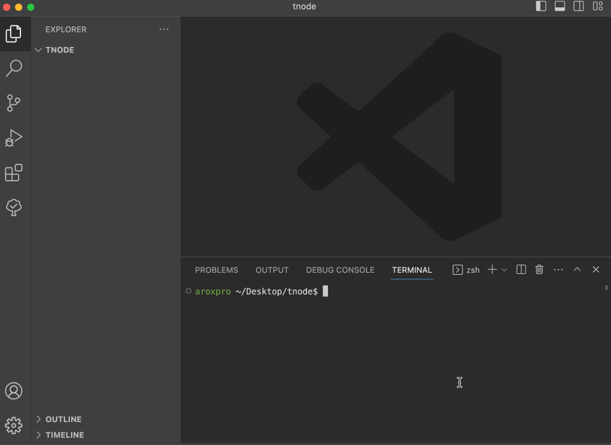

# tnode shell - A bash script to automate nodejs project setup
**Get your NodeJS Typescript project set up with just one command!**


# Motivation
Setting up a nodejs project with typescript and eslint is quite a hassle. Use this bash script for your next nodejs project to save your time.


# Prerequisites
**Bash**: Make sure you have Bash installed on your system. Bash is a commonly used shell and command language on Unix-based systems.

**Node.js**: Ensure that Node.js is installed on your machine. The bash script is designed to work with Node.js projects, so having Node.js installed is necessary.

**npm**: npm is the default package manager for Node.js. Ensure that npm is installed on your system, as the script may utilize npm for installing dependencies or running specific commands.


# How to use tnode shell:
1- Get **tnode.sh** and move it to `/usr/local/bin` in order to be globally accessible on your system. You may need to use `super` to make changes to that directory.

```
mv tnode.sh /usr/local/bin/tnode.sh
```

2- Give the script execution permission.
``` 
chmod +x /usr/local/bin/tnode.sh
```

3- Now just type tnode.sh anywhere on your system!
```
tnode.sh
```

Enjoy the convenience of setting up your Node.js TypeScript projects effortlessly with tnode! 🚀


